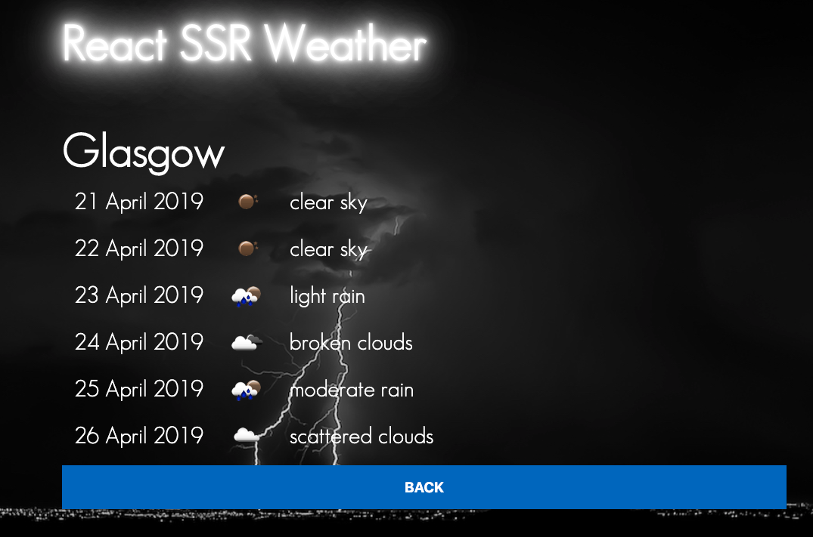
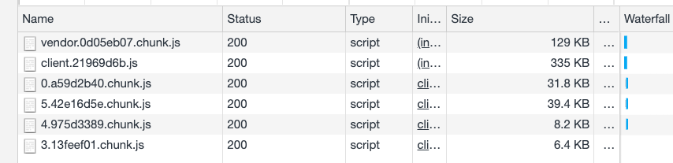

# Weather techical test

## Candidate

Paul Cowan [paul.cowan@cutting.scot](mailto:paul.cowan@cutting.scot)



## Solution

You can view the working solution [here](http://165.22.65.189/)

I wanted to choose a solution that hopefully stands out and I'm gong to make the bold prediction that nobody else will do it the way I have done this.  I have server rendered the react components using a node server rather than a static site.  If you turn off javascript, the site still renders but it is not fully functional without js.  If I had more time I would have done this.

- I was tempted to use hooks as I am using them in my current contract but I decided to server render the react from node rather than a static site that renders in the browser.  If this was a real public site then we want our google juice and google does not like static sites for indexing.

- You cannot yet use hooks with ssr react.

- even though it is a test site, I've used webpack code splitting to ensure that each route only loads only enough javascript and css for that route.



- I can proxy api requests through the node server rather than having to get dirty with CORS even though the weather api accepts all origins.

- I <3 typescript. I have used typescript for frontend and node server code.

I have used my own OSS projects rather than one of the bolier plate projects like create react app that generally end up being bad choices in the long run:

- [@cutting/afterafterjs](https://github.com/dagda1/cuttingedge/tree/master/packages/afterafterjs) - react ssr framework
- [@cutting/devtools](https://github.com/dagda1/cuttingedge/tree/master/packages/devtools) - all my my tooling around webpack,jest and others lives here.  A real time saver.
- [@cutting/react-gel](https://github.com/dagda1/cuttingedge/tree/master/packages/react-gel) - responsive grid
- [@cutting/component-library](https://github.com/dagda1/cuttingedge/tree/master/packages/connected-components) - atomic design component library
- [@cutting/connected-components](https://github.com/dagda1/cuttingedge/tree/master/packages/connected-components) - [formik](https://github.com/jaredpalmer/formik) helpers and other things

## Install

You will need to install [node](https://nodejs.org/en/download/) and [npm](https://www.npmjs.com/get-npm).

You should be running node 11 if possible, that is what I am running and I know node-sass will build on that version.

Once node npm is installed, run

```bash
 npm run doitall
```

## Run tests

The tests use jest.  I've not gone overboard with testing but just enough to show I can write js tests. I am fully versed in the world of js tests.

```bash
 npm test
```
